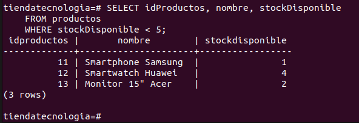
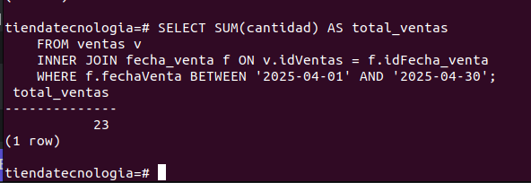

# Gestión de Inventario para una Tienda de Tecnología

## 📄 Descripcion  

    La tienda TechZone es un negocio dedicado a la venta de productos tecnológicos, desde laptops y
    teléfonos hasta accesorios y componentes electrónicos. Con el crecimiento del comercio digital y
    la alta demanda de dispositivos electrónicos, la empresa ha notado la necesidad de mejorar la
    gestión de su inventario y ventas. 

## Modelo E-R 
[Diagrama E-R](modelo/ERDDiagram1.jpg)
## Instruccion para Ejecutar

### Requisitos
    Tener instalado PostgreSQL en tu equipo
### Paso a Paso

    1. Primero clonas el repositorio con el siquiente comando
        git clone https://github.com/hdvalen/ExamenPostgres.git

    2. Despues entra a la consola de su equipo y escriba el siguiente comando  e ingresa la contraseña
        psql host:localhost -U postgres 

    3. Despues copias el archivo de db.sql y pegas, este creara la base de datos y las tablas con sus respectivos atributos y tipos de datos

    4. Ya ejecutado y creado la base de datos con sus tablas, copias el archivo inserts.sql y pegas, este insertara datos a tu base de datos

    5. Despues de haber insertado los datos se pueden realizar diferentes consultas 

## Descripcion de los Archivos

1. [Archivo db.sql](db.sql): Este archivo contiene la creacion de base de datos y tablas con sus respectivos atributos y tipos de datos 
2. [Archivo inserts.sql](inserts.sql): Este archivo contiene todos los inserts de datos de cada tabla 
3. [Archivo queries.sql](queries.sql): Este archivo contiene 5 consultas de ventas, productos, clientes y las fechas
4. [Archivo procedureAndFunctions.sql](procedureAndFunctions.sql): Este archivo tiene funciones y procedimientos con los que se puede regitrar, validar y      buscar en la base de datos 

## Ejemplos

